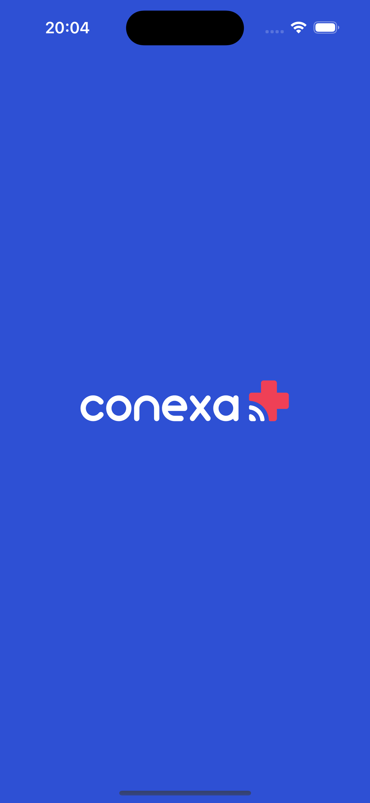
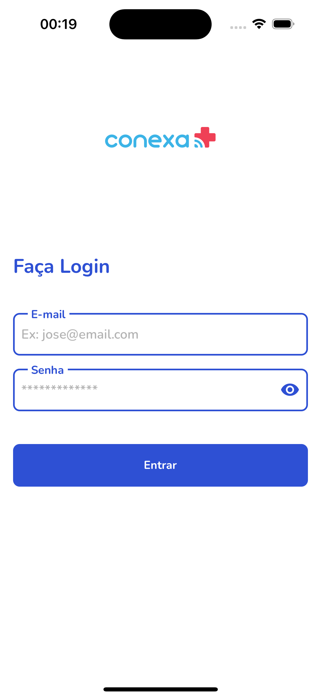
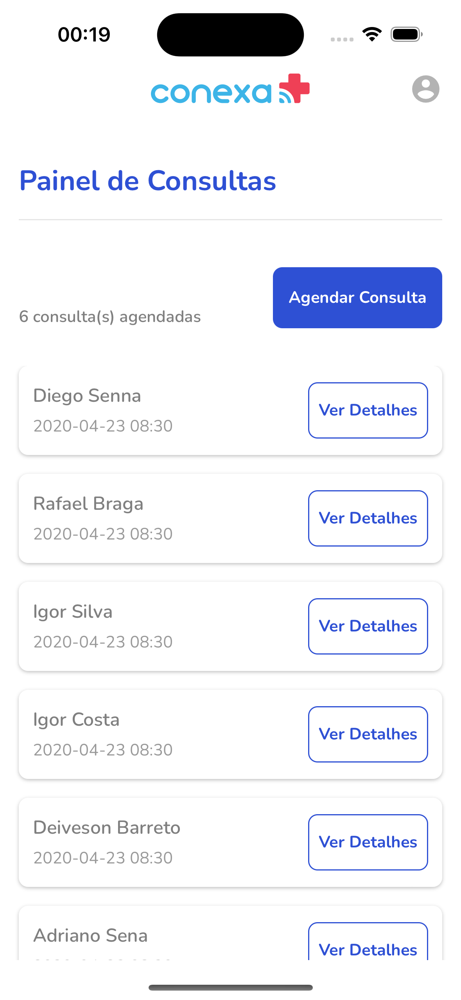
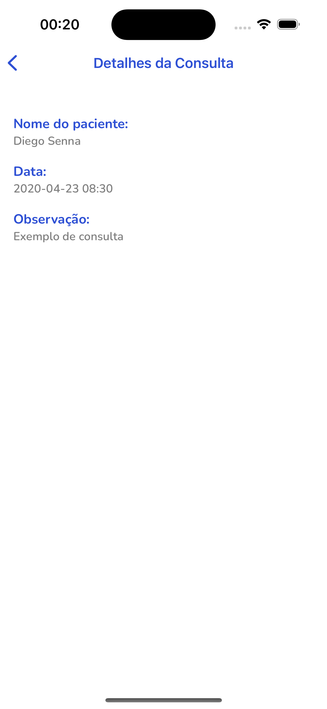
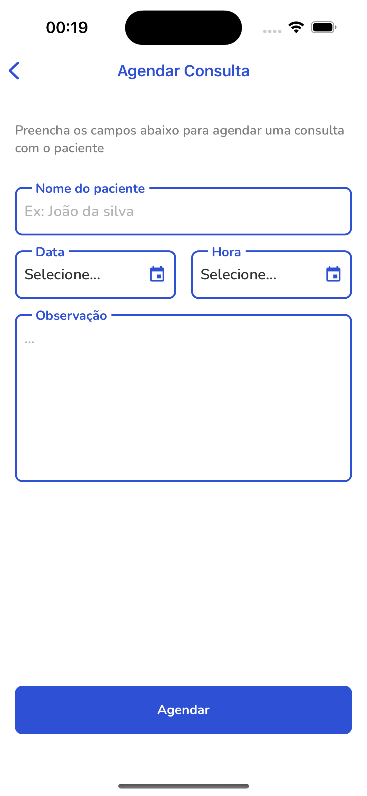
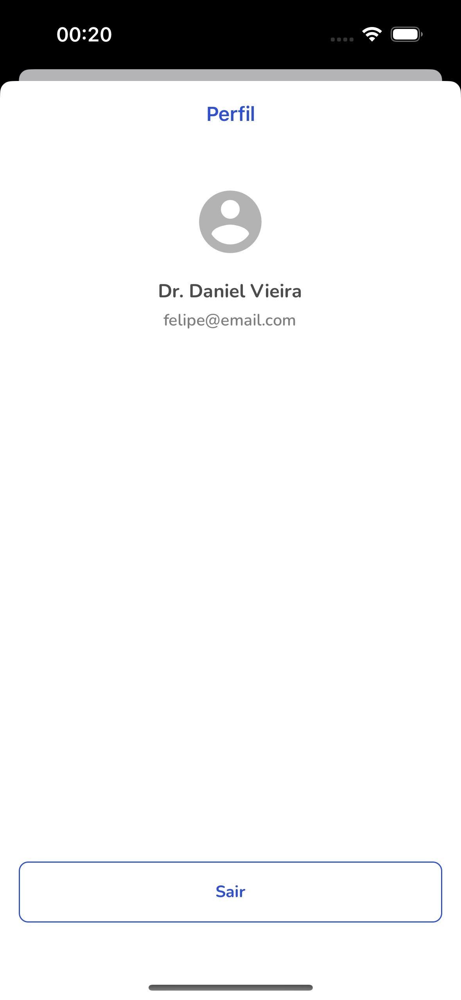

## Tasks

- [x] Tela de Login
- [x] Tela consultas
- [x] Tela para agendar consultas
- [x] Tela de detalhes da consulta
- [x] Tela de perfil
- [x] Tela de sync
- [x] Testes unitarios


## Como Executar

```terminal
Clone o repositorio:
$ git clone git@github.com:iamlipe/desafio-tecnico-frontend-mobile-conexa.git

$ cd desafio-tecnico-frontend-mobile-conexa

$ git checkout feature/app-conexa

Configure o arquivo .env:
Existe um arquivo .env.example na raiz do projeto, basta renomeá-lo para apenas .env.

Instale todas as dependências:
$ yarn install

Iniciar o app no IOS:
$ cd ios pod install && cd ..
$ yarn run ios

Iniciar o app no Android:
$ yarn run android

executar testes unitários
$ yarn run test
```

## Preview

<div>
 
 
 
 
 
 
</div>
