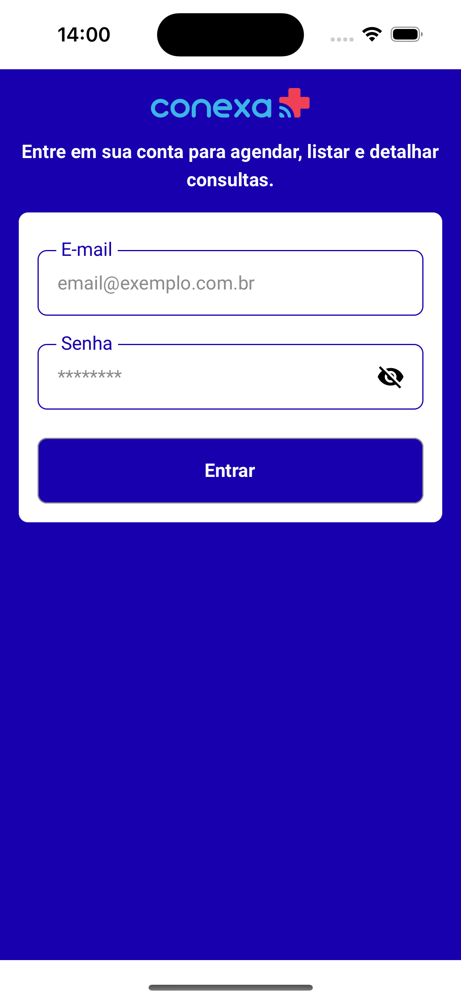
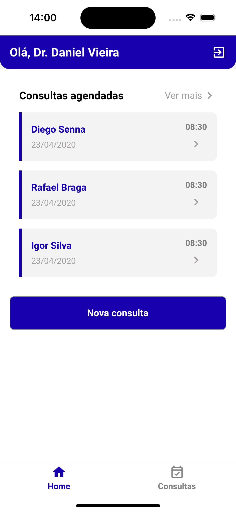
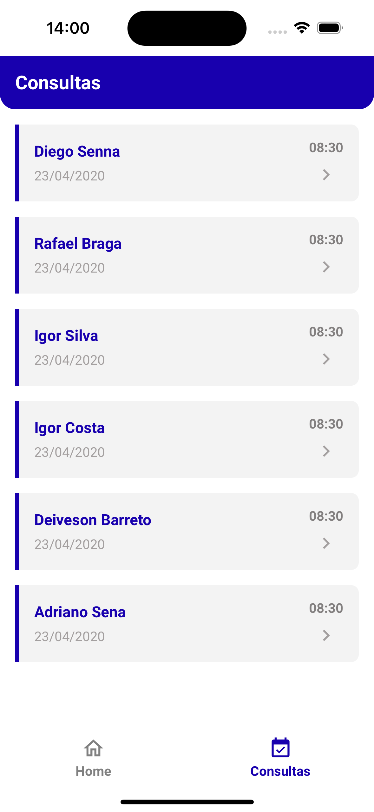
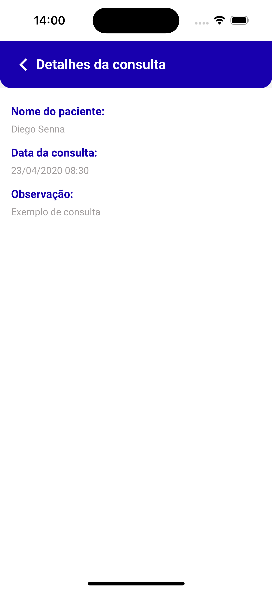
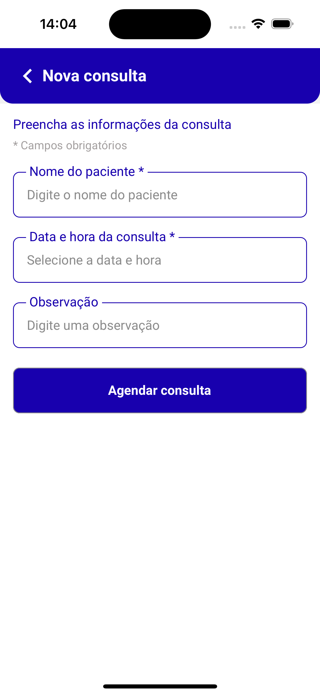

## Instalação e como executar

```terminal
Clone o repositorio:
$ git clone git@github.com:diogoalvesf/desafio-tecnico-frontend-mobile-conexa.git

$ cd desafio-tecnico-frontend-mobile-conexa

$ git checkout feature/create-app-conexa-saude

Criar um arquivo .env na raiz do projeto com a propriedade:
BASE_URL=http://desafio.conexasaude.com.br

Instalar todas as dependências:
$ yarn

Iniciar o app no iOS:
$ npx pod-install
$ yarn ios

Iniciar o app no Android:
$ yarn android
```

## Preview

<div>
 
 
 
 
 
</div>