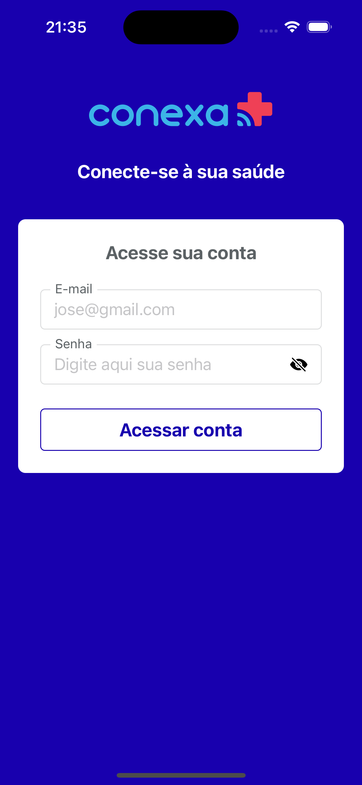
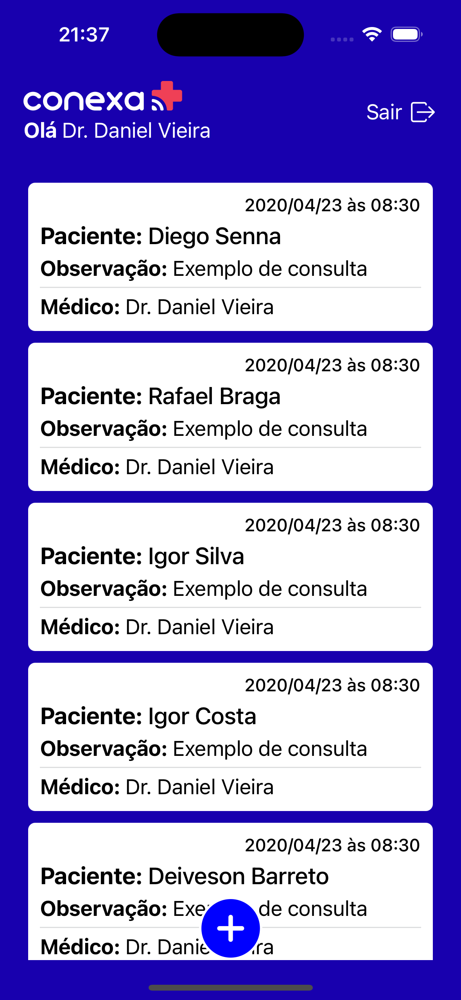
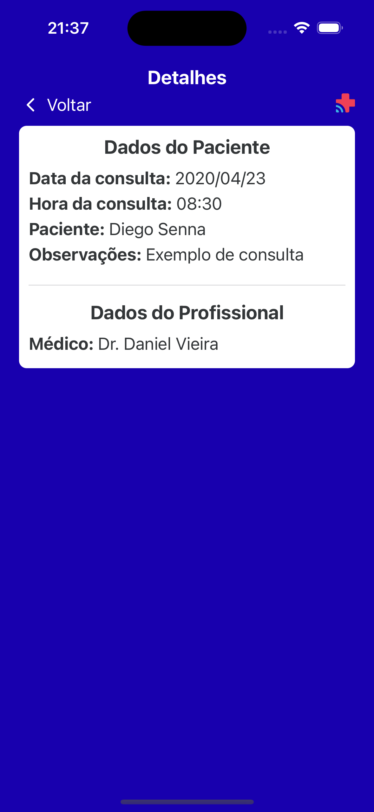
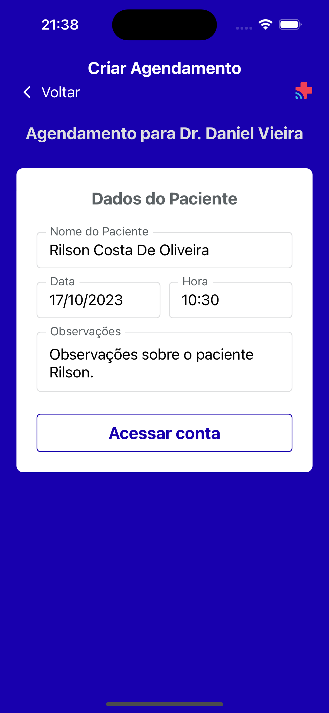
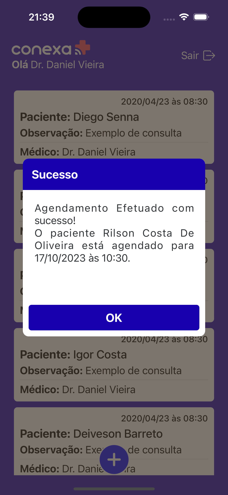

<h1 style="text-align: center;">CONEXAAPP</h1>
<br>
<p align="center">
  
</p>

> This is a [**React Native**](https://reactnative.dev) project, bootstrapped using [`@react-native-community/cli`](https://github.com/react-native-community/cli). The App covers sing-in, get list of appointments, get appointment by id, and create appointment.

<br>

<p  align="center">
  
  
  
  
  
</p>

<br>

## ✨ Features

The project covers the following functionalities:

- ✅ SignIn
- ✅ Create an Appointment
- ✅ List all Appointments
- ✅ Details an Appointment

<br>
<br>

# 💻 Getting Started

> **Note**: Make sure you have completed the [React Native - Environment Setup](https://reactnative.dev/docs/environment-setup) instructions till "Creating a new application" step, before proceeding.

## ⚙️ Environment

Copy the `.env.example` file, after, rename it to `.env`, and follow its instructions.

## ⚙️ Install

For the installation of the project, follow the steps:

After clone the project:

Go to project path in your terminal:

```
cd conexaapp
```

Run the command to install all packages:

```
npm install
```

Go to ios path:

```
cd ios
```

Run the command to install all pods:

```
npx pod install
```

## 🚀 Running the App

After installing the packages just run the command:

```
npx react-native run-android
```

Or

```
npx react-native run-ios
```
<br>

## Running the App

To run tests, just run the command:

```
npm test -- -u
```
To run coverage tests, just run the command:

```
npm run coverage
```
<br>

> **About API**:

- The endpoint `/api/login` does not return the user id. So in the endpoint `/api/consulta` method `POST`, the `idMedico` field contains the value 12 defined statically.
- The endpoint `/api/consulta` method `POST`, does not really include the new appointment into your data base. Then the home screen listing will not be updated.
- The endpoint `/api/consultas` method `GET` was not paginated, so there was no implementation of infinite scroll.

## 🤝 Collaborators

Thanks to the following people who contributed to this project:

<table>
  <tr>
    <td align="center">
      <a href="https://github.com/RilsonO">
        <br>
        <sub>
          <b>Rilson C Oliveira</b>
        </sub>
      </a>
    </td>
  </tr>
</table>
